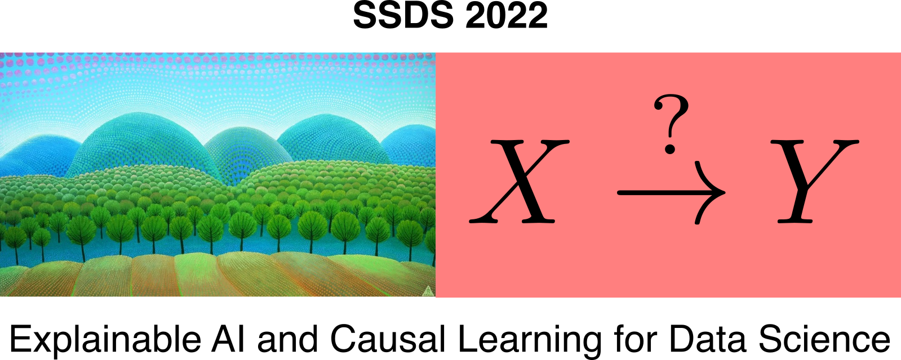

#### **Hands-on session:** **Causality for Machine Learning**

---

Open a Colab session. Select runtime "GPU" if wished. Then add the local files from the git repository to the runtime (otherwise the dependencies break). Then simply run and enjoy :heart_eyes:

The guide through slides for running this on your own are provided in `SSDS22-Hands-On-Causality-for-Machine-Learning.pdf`. Enjoy! :herb: